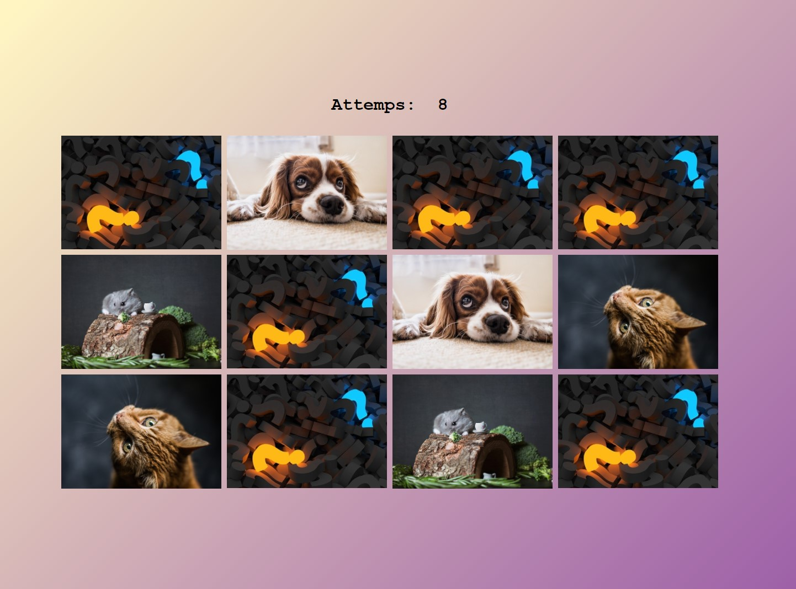

# Memory Card Game

[This project](https://gurhanalan.github.io/JS-SmallProjects-MemoryCardGame/) is a one-page website where user tries to match the cards that are covered.

## Table of contents

- [Memory Card Game](#memory-card-game)
  - [Table of contents](#table-of-contents)
  - [Overview](#overview)
    - [The challenge](#the-challenge)
    - [Screenshots](#screenshots)
    - [Links](#links)
  - [My process](#my-process)
    - [Built with](#built-with)

## Overview

### The challenge

Users should be able to:

<!-- -   View the optimal layout for the app depending on their device's screen size -->

-   See hover states for all interactive elements on the page
-   Match the cards that are covered.

### Screenshots

 

### Links

-   Solution URL: [Live Website](https://gurhanalan.github.io/JS-SmallProjects-MemoryCardGame/)

## My process

### Built with

-   Semantic HTML5 markup
-   CSS custom properties
-   CSS Flexbox
-   Desktop-first workflow
-   Javascript
